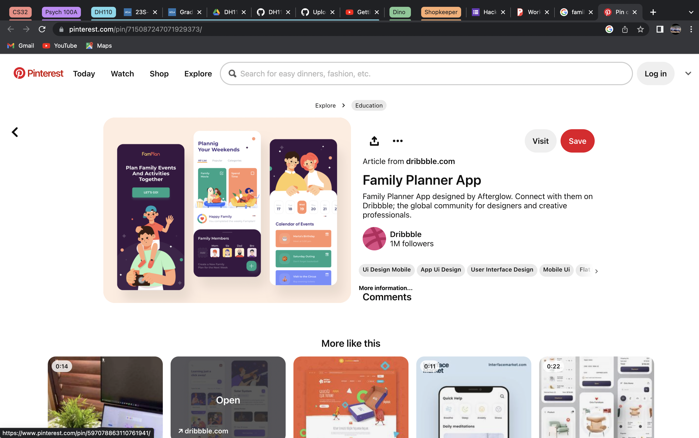

# DH110-Joaquincruz
I plan on working on an assignment where I can analyze two family planner apps and could eventually come up with my own app where family members will be allowed to plan out dates to spend time together. As well make sure that they can use the monthly calender and allow them to even plan out meals and other choirs they have to do. 

https://be.my.ucla.edu/studylist.aspx

[goto NPR](http://npr.org)

